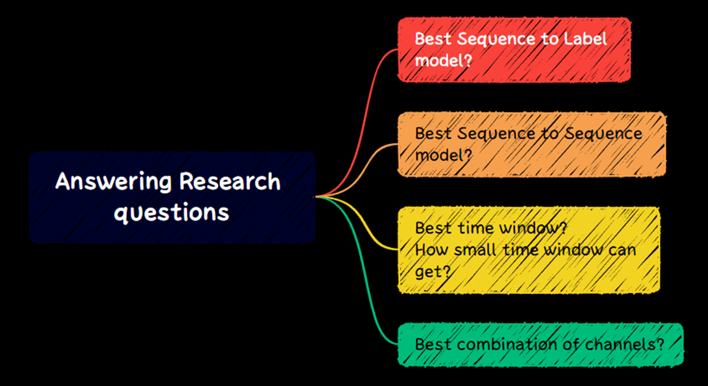

# REadme

# Dataset:

The dataset is from [https://www.kaggle.com/competitions/tlvmc-parkinsons-freezing-gait-prediction](https://www.kaggle.com/competitions/tlvmc-parkinsons-freezing-gait-prediction) 

The file worked on was the **tDCS FOG**

# Research questions:

# Setup:

# Models pipeline:

# Results:

## Accuracy reached 86%
